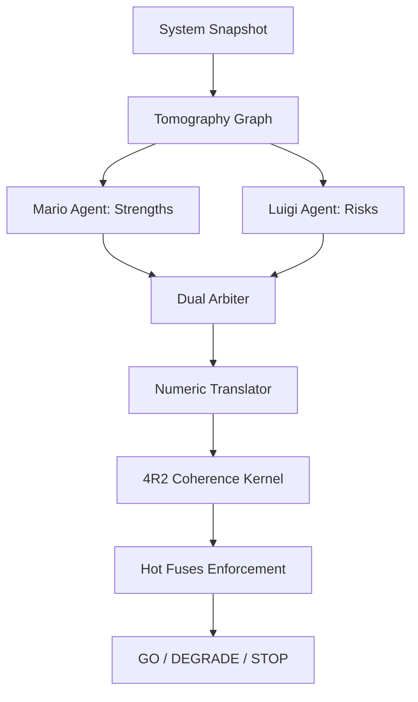

# 4R2 + Antigravity Wings v5.3: Enterprise AI Governance

---

## Slide 1: The Core Problem
### The Governance Gap in Autonomous AI

- **Drift & Hallucinations**: Standard LLM agents drift over time, violating policies.
- **Non-Determinism**: Traditional test suites cannot predict agent behavior in runtime.
- **Resource Blindness**: AI agents do not optimize for hardware latency, memory, or FLOPS.
- **Audit Failure**: Regulatory bodies demand cryptographically sealed evidence of decisions.

---

## Slide 2: The Solution
### 4R2 Coherence Engine + Antigravity Wings

- **Geometric Alignment**: Maps agent intent, logic, and hardware to a 4-dimensional vector space (N-R-I-F).
- **Sub-milisegundo In-Process**: Instantly blocks decisions if any single layer (policy, model, data, hardware) drifts without network serialization overhead.
- **Resilient Exoesqueleto**: Intercepts actions in real-time, enforcing policy without modifying the core AI model.
- **Audit-Ready Evidence**: SHA-256 chained logs capturing all intermediate reasoning states.

---

## Slide 3: System Architecture Overview

---

## Slide 4: The 4R2 Coherence Formula

Total Coherence ($C_{total}$) is defined as a weighted sum (NOT a product): $C_{total} = w_{NR} C_{NR} + w_{RI} C_{RI} + w_{IF} C_{IF}$, subject to $\sum w_j = 1.0$. This formulation provides exact diagnostic granularity (identifying which specific layer fails) and guarantees the numerical stability of backpropagation, avoiding gradient collapse issues typical of product-based functions.

**Production Default (Hard-Gate, ADR-0005)**:
- **$w_{NR} = 1/3$**: Normative vs Representational (Ethics vs World Model).
- **$w_{RI} = 1/3$**: Representational vs Informational (World Model vs Data Flow).
- **$w_{IF} = 1/3$**: Informational vs Physical (Data Flow vs Hardware Constraints).

> *Physics-priority profile* ($w_{NR}=1/21, w_{RI}=4/21, w_{IF}=16/21$) is available for hardware-throughput benchmarks as an explicit opt-in. It is **never** the default, as it introduces a normative blind-spot vulnerability (ADR-0005).

---

## Slide 5: Memory Tracking & Cognitive Decay

### BeliefTracker (MVBS v2.0)
- Separates invariant rules (**Semantic**) from temporary facts (**Episodic**).
- **Ebbinghaus Decay**: Episodic memory decays exponentially over time:
  $$P(t) = P_0 \cdot e^{-t/\tau}$$
- Prevents cognitive overload and handles contradiction costs dynamically.

---

## Slide 6: Operational Landauer Cost

- **Logical Irreversibility Penalty**: Rewriting decisions is costly.
- We penalize changes dynamically:
  $$E_{min} = k_B \cdot T \cdot \ln(2) \cdot N_{\text{changes}}$$
- **Result**: Drives agent stability, preventing volatile action loops and reducing execution cost.

---

## Slide 7: Hardening & Enterprise Resilience

- **Fail-Open Circuit Breaker**: Wraps the HTTP endpoint. Opens within 3.0s of network degradation.
- **Strict Rate Limiting**: Intercepts API requests at 60 req/min, protecting endpoints from DDoS or agent feedback loops.
- **Verification Guard Registry**: Dynamic fuses evaluate contextual inputs and apply hard vetos.

---

## Slide 8: Validation Results (v5.3 Release)

- **Test Pass Rate**: **100% (60/60 tests)** passing locally.
- **Determinism Harness**: Output hashes are strictly reproducible across multiple processes ($10^{-12}$ error threshold).
- **Insurance Pilot**: Verified E2E with strict contract compliance and signed evidence bundles.

---

## Slide 9: IP Value & Market Advantage

- **Algorithm Portability**: Kernel runs locally (in-process) or as a secure microservice (FastAPI/NumPy).
- **Vector DB Independence**: The Obsidian $\leftrightarrow$ SurfSense promotion protocol reduces vector storage index costs.
- **Audit-Grade Compliance**: Ready for SOC2, HIPAA, and EU AI Act audits.

---

## Slide 10: Next Steps

1. **Partner Pilots**: Deploy the Insurance Fast-Track agent in staging environments.
2. **arXiv Submission**: Publish the thermodynamic AI alignment paper.
3. **Patent Portfolio**: Lock in the intellectual property of the weighted-sum multi-layered coherence formula.
