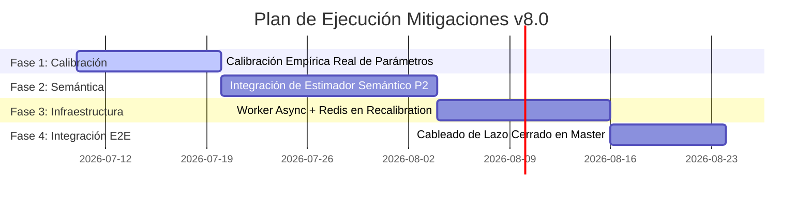

# INVENTARIO DE PROPIEDAD INTELECTUAL Y REGISTRO DE GAPS — ECOSISTEMA 4R2

**Fecha:** 2026-07-08  
**Versión de Producto:** 7.0.0  
**Ubicación de Salida Autorizada:** [espacio antigravity](file:///c:/Users/USER/Documents/4R2%20repo%20maestro%20jul2026/espacio%20antigravity)

---

## 1. Inventario de Propiedad Intelectual (IP)

> [!CAUTION]
> **ADVERTENCIA LEGAL:** Este documento constituye un briefing técnico descriptivo preparado para ser entregado a un abogado de patentes calificado. **NO constituye una solicitud de patente formal ni asesoría legal.**

La estrategia de protección del ecosistema 4R2 se basa en una combinación de patentes (para procesos técnicos y arquitecturas aplicadas) y secretos comerciales (para datos y parámetros calibrados). La matemática pura aislada del kernel de coherencia no se considera elegible para patente de forma independiente (según el criterio de materia abstracta *Alice/Mayo* en EE. UU.), pero sí lo es la combinación de mecanismos en tiempo de ejecución.

### 1.1 Invenciones Candidatas (Borrador de Divulgación)

#### INV-A: Recalibración Térmica de Umbrales de Seguridad en Tiempo Real (I²t)
* **Descripción:** Método y sistema que computa una señal de criticidad puntual de transacciones en un motor de decisiones IA y la integra dinámicamente en el tiempo mediante un modelo térmico con memoria y decaimiento exponencial ($T_t = T_{t-1} \cdot e^{-\Delta t/\tau} + e_i$). Al superar un umbral crítico de temperatura acumulada, el sistema dispara automáticamente una recalibración gobernada de los umbrales de seguridad, permitiendo que el guardrail responda sensiblemente a derivas y ataques sostenidos por acumulación que son invisibles a filtros estáticos de un solo paso.
* **Soporte Técnico:** [accumulator.py](file:///c:/Users/USER/Documents/4R2%20repo%20maestro%20jul2026/antigravity_wings/antigravity_wings/thermal/accumulator.py), [test_thermal_accumulator.py](file:///c:/Users/USER/Documents/4R2%20repo%20maestro%20jul2026/antigravity_wings/tests/test_thermal_accumulator.py), [ADR-0009](file:///c:/Users/USER/Documents/4R2%20repo%20maestro%20jul2026/docs/adr/ADR-0009-thermal-i2t-accumulator.md).

#### INV-B: Autoridad de Escritura Única mediante Token Desechable de un Solo Uso
* **Descripción:** Mecanismo de seguridad que implementa un canal exclusivo de modificación del estado del guardrail (`FuseSpec`). Las capas observadoras y el pipeline síncrono caliente carecen de privilegios de escritura; las modificaciones solo pueden ser realizadas por un módulo de arbitraje (`ArbiterAuthority.write_fuse`) y requieren la presentación de un token criptográfico no reutilizable (de un solo uso) firmado previamente por una autoridad judicial independiente (`Judge`) tras validar un umbral de confianza sobre la telemetría térmica acumulada.
* **Soporte Técnico:** [arbiter.py](file:///c:/Users/USER/Documents/4R2%20repo%20maestro%20jul2026/antigravity_wings/antigravity_wings/dual_agents/arbiter.py), [test_judge_mosef.py](file:///c:/Users/USER/Documents/4R2%20repo%20maestro%20jul2026/antigravity_wings/tests/test_judge_mosef.py), [ADR-0012](file:///c:/Users/USER/Documents/4R2%20repo%20maestro%20jul2026/docs/adr/ADR-0012-judge-mosef-rewrite.md).

#### INV-C: Vector de Reroute Gobernado como Alternativa Adaptativa al Bloqueo Binario
* **Descripción:** Proceso en tiempo de ejecución que, ante una decisión de bloqueo (`STOP`) de un nodo crítico, consulta dinámicamente un registro de desvíos y calcula un vector de rutas de escape alternativas (`RerouteOption`) que preserva la necesidad operativa legítima del agente sin comprometer la seguridad. Si no hay ruta registrada para el nodo en conflicto, el sistema se cierra por defecto (*fail-closed*).
* **Soporte Técnico:** [dual_runtime.py](file:///c:/Users/USER/Documents/4R2%20repo%20maestro%20jul2026/antigravity_wings/antigravity_wings/operators/dual_runtime.py), [test_reroute_vector.py](file:///c:/Users/USER/Documents/4R2%20repo%20maestro%20jul2026/antigravity_wings/tests/test_reroute_vector.py), [ADR-0010](file:///c:/Users/USER/Documents/4R2%20repo%20maestro%20jul2026/docs/adr/ADR-0010-reroute-vector.md).

### 1.2 Matriz de Estrategia de Activos de IP

| Activo Tecnológico | Clasificación | Vía de Protección Recomendada | Racional |
| :--- | :--- | :--- | :--- |
| **Fórmulas del Kernel (v6.1.0)** | Algoritmo Matemático | **Publicación Defensiva** | Impedir que terceros patenten las fórmulas de distancia angular en NRIF, creando *prior art* público. |
| **Integración I²t Térmica** | Proceso del Sistema | **Patente de Sistema/Método** | Modificación del comportamiento físico de un sistema informático en runtime. Altamente defendible. |
| **Token de Escritura Única** | Protocolo de Control | **Patente de Método** | Protocolo lógico auditable y de control de integridad de datos de runtime. |
| **Redirección Reroute** | Lógica de Mitigación | **Patente de Sistema** | Comportamiento novedoso diferenciado frente a firewalls binarios tradicionales. |
| **Parámetros ($\tau, T_{trip}$, etc.)** | Datos de Configuración | **Secreto Comercial** | Ventaja competitiva no divulgar el ajuste óptimo de laboratorio. |
| **Corpus de Calibración Interno** | Conjunto de Datos | **Secreto Comercial** | Activo exclusivo de entrenamiento y calibración, sin revelación pública. |

---

## 2. Estado del Arte y Prior Art

Para evitar el rechazo o invalidación de patentes, la redacción técnica debe diferenciarse con precisión de los siguientes desarrollos publicados en 2025 y 2026:
1. **DeepContext (2026):** Utiliza redes recurrentes para evaluar variaciones semánticas turno-a-turno sobre embeddings de diálogo. *Diferencia:* 4R2 no usa inferencia de redes neuronales recursivas en caliente; usa una integral I²t determinista sobre criticidades puntuales.
2. **TRACE / TrajAD (2025):** Sistemas de detección de anomalías en trayectorias de agentes. *Diferencia:* 4R2 es un fusible activo de recalibración gobernado por un juez y un árbitro con autoridad única y rutas de desvío (Reroute), no un detector pasivo de logs.
3. **Tendencias de Adquisición:** La reciente actividad del sector (como Lakera adquirida por Check Point, o Protect AI adquiriendo AgentCop/Palo Alto) eleva la exigencia probatoria para la exclusividad tecnológica en la capa de seguridad en tiempo de ejecución.

---

## 3. Registro de Brechas Técnicas (GAPS)

La auditoría del código y los históricos ha detectado las siguientes brechas operativas y de seguridad que representan deuda técnica crítica:

### 🔴 GAP #1: Calibración Empírica Inexistente de Parámetros Térmicos
* **Gravedad:** Alta  
* **Descripción:** Los valores para el decaimiento de calor $\tau$, el umbral de disparo $T_{trip}$ y el umbral de referencia $\theta_{ref}$ (en [accumulator.py](file:///c:/Users/USER/Documents/4R2%20repo%20maestro%20jul2026/antigravity_wings/antigravity_wings/thermal/accumulator.py)) son valores estáticos elegidos de forma analítica en el laboratorio.  
* **Riesgo:** El acumulador puede disipar el calor excesivamente rápido y no disparar recalibraciones ante derivas lentas, o saturarse inmediatamente ante operaciones regulares, lo que provocaría interrupciones innecesarias.

### 🔴 GAP #2: La Cola de Recalibración es una Semilla Lógica, No una Infraestructura Real
* **Gravedad:** Media-Alta  
* **Descripción:** El desacoplamiento en `RecalibrationQueue` implementa un canal diferido (`drain()`), pero carece de un trabajador asíncrono real en segundo plano, colas de mensajería (como Redis o RabbitMQ) o persistencia del bus de eventos.  
* **Riesgo:** Todo el procesamiento del Juez y el Árbitro sigue requiriendo llamadas síncronas invocadas explícitamente en el ciclo de ejecución o en los tests. Un cuelgue del hilo del servidor bloquea la evaluación.

### 🔴 GAP #3: Fragilidad del Clasificador CCA ante Paráfrasis
* **Gravedad:** Media-Alta  
* **Descripción:** La estimación de la criticidad en `CCA.observe` está basada estrictamente en heurísticas léxicas (búsqueda de palabras clave como "dinero", "ip" o verbos específicos).  
* **Riesgo:** Ataques de elusión léxica (por ejemplo, escribir "mueve el capital" en lugar de "transfiere dinero") logran una criticidad asignada baja ($0.3$), evadiendo la estimación de riesgo. Aunque el fix P0 en v7.8 establece un piso conservador de $0.50$ para casos "unclassified", esto solo hace visible el evento al térmico, pero no previene la evasión del gate puntual si el texto es semánticamente coherente.

### 🟡 GAP #4: Desconexión End-to-End de la Recalibración en el Pipeline Vivo
* **Gravedad:** Media  
* **Descripción:** Los componentes individuales (Juez, token de único uso, recalibración de fusibles) están aislados e implementados en pruebas. Sin embargo, el método de orquestación principal `execute_full_analysis` en [master.py](file:///c:/Users/USER/Documents/4R2%20repo%20maestro%20jul2026/antigravity_wings/antigravity_wings/orchestration/master.py) no invoca activamente el bucle completo de recalibración asíncrona tras el disparo del fusible térmico. El lazo está fragmentado.

### 🟡 GAP #5: Acoplamiento de Persistencia Local
* **Gravedad:** Baja  
* **Descripción:** El guardado del snapshot térmico (P1) escribe en archivos JSON locales de forma atómica.  
* **Riesgo:** En despliegues multi-nodo horizontales (detrás de balanceadores de carga), la memoria térmica se desincronizará entre diferentes pods de sidecar al no compartir una base de datos distribuida o almacén de clave-valor centralizado (como Redis).

---

## 4. Plan de Mitigación y Hoja de Ruta para v8.0

Para llevar el sistema a un nivel óptimo de preparación para producción y asegurar la robustez de la IP frente a auditorías externas, se proponen los siguientes hitos de desarrollo técnico prioritarios:

1. **Hito 1 — Calibración Térmica Empírica (Semana 1-2):**
   * Correr simulaciones masivas con perfiles de tráfico reales utilizando la suite de calibración con datos simulados del benchmark para definir los valores reales óptimos de $\tau$, $T_{trip}$ y $\theta_{ref}$.
2. **Hito 2 — Integración del Estimador Semántico P2 (Semana 2-4):**
   * Activar la dependencia `sentence-transformers` en la cola asíncrona de fondo para evaluar de manera semántica profunda y re-estimar la criticidad de los payloads, reemplazando progresivamente el piso estático de $0.50$ de P0.
3. **Hito 3 — Robustecimiento de la Infraestructura Asíncrona (Semana 4-5):**
   * Crear un worker async formal (mediante asyncio o Celery) y persistir el bus en Redis. Resolver la persistencia distribuida del estado térmico de los nodos para despliegues escalables de sidecar.
4. **Hito 4 — Cierre del Lazo Master (Semana 6):**
   * Cablear en `execute_full_analysis` la llamada de recalibración diferida automatizada para que el ciclo "observar → acumular → fundir → juzgar → reescribir fusible" ocurra de forma autónoma sin intervención humana.

---
*Fin del informe de IP y Gaps.*
